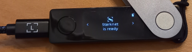

# Starknet-Ledget-Wallet

  

<h2 style="text-align: center;"> Demo DAPP to use a Ledger Nano with Starknet</h2>
  

> [!IMPORTANT]
> **This DAPP has not been audited ; use at your own risks.**

> [!NOTE]
> **Stars are highly appreciated! Thanks in advance.**

## Launch 🚀 : 

### local
`npm run dev` then open http://localhost:3000/

### Deployed DAPP
https://starknet-ledger-wallet.vercel.app/

NanoX bluetooth : experimental : https://starknet-ledger-wallet-git-nanox-philipper26s-projects.vercel.app/

## Browsers :

| Browser | compatible |
| --- | :---: |
| Firefox | ❌ |
| Chrome | ✅ |
| Brave (*) | ✅ |
| Safari | ❌ |
| Edge | TBD |
| IE | ❌ |

(*) = Needs to deactivate shield.

## Ledger Nano :

| Ledger | compatible |
| --- | :---: |
| Nano S | ❌ |
| Nano S+ | ✅ |
| Nano X | ✅ |

The Starknet APP has to be installed in your Ledger. If not visible in Ledger Live, set its configuration to  `experimental`.

> [!NOTE]
> This DAPP is compatible with the Ledger Starknet APP v1.1.1

This version of DAPP requests to connect the Ledger Nano to an USB connector of your computer.

# Network :

Today, the DAPP is only working with the [devnet-rs](https://github.com/0xSpaceShard/starknet-devnet-rs) network. 
