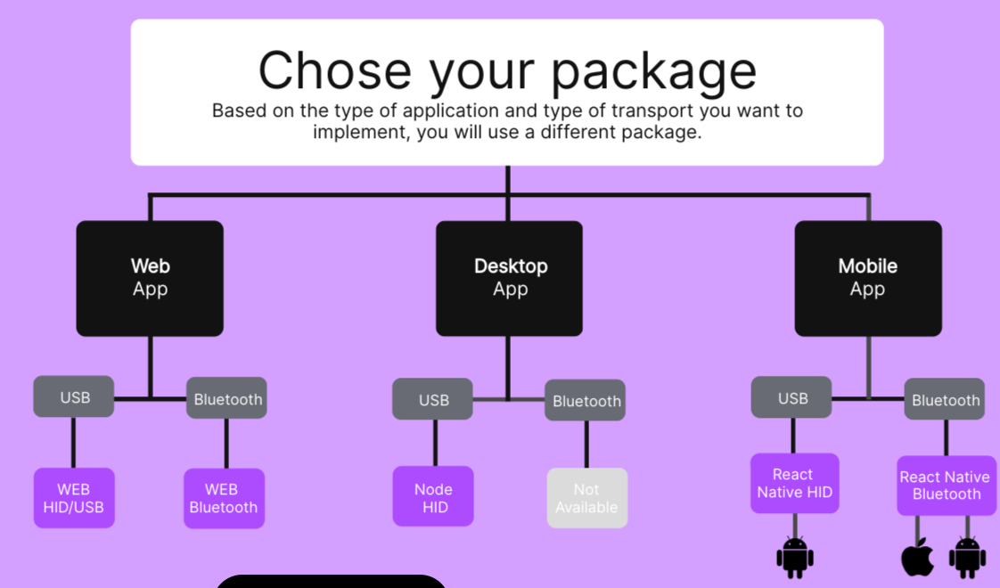

# Starknet-Ledger-Wallet


<p align="center">
  
</p>

<h2 style="text-align: center;"> Demo DAPP to use a Ledger Nano with Starknet</h2>
<br></br>

> [!IMPORTANT]
> **This DAPP has not been audited ; use at your own risks.**

> [!NOTE]
> **Stars are highly appreciated! Thanks in advance.**

## Launch 🚀 : 

### local
Launch a local devnet : https://0xspaceshard.github.io/starknet-devnet/docs/running/install

`npm run dev` then open http://localhost:3000/

### Deployed DAPP
https://starknet-ledger-wallet.vercel.app/

NanoX bluetooth : experimental : https://starknet-ledger-wallet-git-nanox-philipper26s-projects.vercel.app/
(do not work on linux mint)

## Browsers :

| Browser | compatible |
| --- | :---: |
| Firefox | ❌ |
| Chrome | ✅ |
| Brave (*) | ✅ |
| Safari | ❌ |
| Edge | TBD |
| IE | ❌ |

(*) = Needs to deactivate shield.

## Ledger Nano :

| Ledger | compatible |
| --- | :---: |
| Nano S | ❌ |
| Nano S+ | ✅ |
| Nano X | ✅ |

The Starknet APP has to be installed in your Ledger. If not visible in Ledger Live, set its configuration to  `experimental`.

> [!NOTE]
> This DAPP is compatible with the Ledger Starknet APP v2.3.1

This version of DAPP requests to connect the Ledger Nano to an USB connector of your computer.

> [!NOTE]
> The last version of the Ledger Starknet APP (v2.3.1) supports explained V1 (ETH, Rpc 0.7) & V3 (STRK, Rpc 0.7 & 0.8) transactions & deploy accounts. For a class declaration or a message, you will have to blind sign a hash ; sign only hashes from a code that you trust. Do not forget to enable `Blind signing` in the APP settings.


# How to code?

You have to use a transporter to interact with the Ledger Nano. Depending if you use an USB or a Bluetooth connection, depending on your framework (Node, Web, Mobile), you have to use the appropriate library to create your transporter.

The Ledger documentation lists all the available cases:


The libs available are:

```typescript
import TransportNodeHid from '@ledgerhq/hw-transport-node-hid';
import TransportWebHid from '@ledgerhq/hw-transport-webhid';
import TransportWebBluetooth from '@ledgerhq/hw-transport-web-ble';
import TransportHID from '@ledgerhq/react-native-hid';
import TransportBLE from '@ledgerhq/react-native-hw-transport-ble';
import type Transport from '@ledgerhq/hw-transport'; // type for the transporter
```

## Connect

An example of a Ledger connected with an USB cable, used from a web browser (e.g. Chrome):
```typescript
import TransportWebHid from "@ledgerhq/hw-transport-webhid";
import type Transport from "@ledgerhq/hw-transport";
const myLedgerTransport: Transport = await TransportWebHid.create();
```

To disconnect:
```typescript
await myLedgerTransport.close();
```

> [!IMPORTANT]
> - Only one connection at the same time in your computer.
> - The Ledger shall be connected, unlocked, with the Starknet internal APP activated, before connection.

## Creation of the signer

Create a signer:
```typescript
const myLedgerSigner = new LedgerSigner231(myLedgerTransport, 0);
```
Then create an Account instance that uses this signer:
```typescript
const ledgerAccount = new Account({
  provider: myProvider,
  address: ledger0addr,
  signer: myLedgerSigner,
});
```
You can now use `ledgerAccount` as any Account instance, just the signature is requested in the Ledger for each transaction.


## Read Ledger information
If you want to read the version of the Ledger Starknet APP:

```typescript
const resp = await myLedgerTransport.send(Number('0x5a'), 0, 0, 0);
const appVersion = resp[0] + '.' + resp[1] + '.' + resp[2];
console.log('version =', appVersion);
```

To get the public key:
```typescript
const pubK = await myLedgerSigner.getPubKey();
const fullPubK = await myLedgerSigner.getFullPubKey();
```


# Network :

Today, the DAPP is only working with the [devnet](https://0xspaceshard.github.io/starknet-devnet/docs/intro) network. 

Note that to handle devnet, I am using this lib :  
`"starknet-devnet": "0.6.0",`

To use this lib, some code has to be added in `next.config.ts` :
```typescript
webpack: (config) => {
    config.resolve.fallback = {
      fs: false,
      net: false,
      child_process: false,
    }
    return config;
  }
```